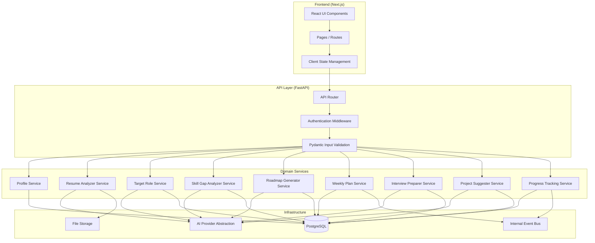
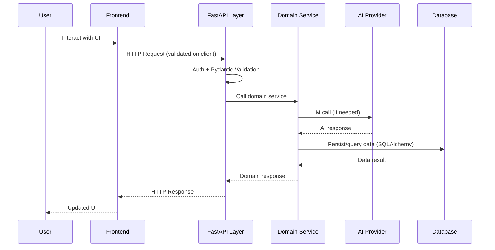
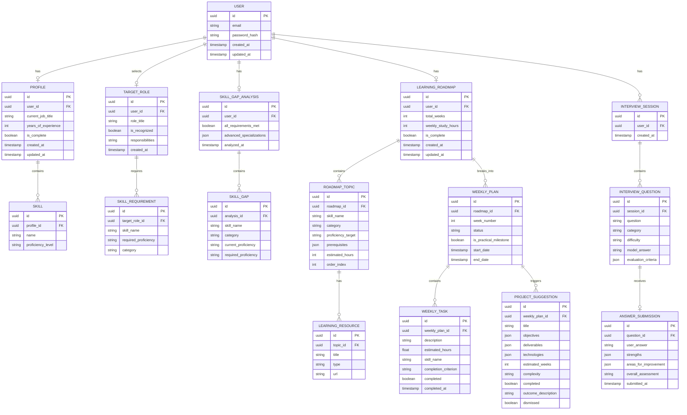

# Design Document: Smart Career Roadmap Generator

## Overview

The Smart Career Roadmap Generator is a full-stack web application that helps users plan career transitions by analyzing their current skills, identifying gaps relative to a target role, and generating personalized learning roadmaps. The system integrates AI (via LLM APIs) for resume parsing, skill gap analysis, roadmap generation, mock interview question creation, and project suggestions.

The platform follows a progressive workflow: Profile Creation → Target Role Selection → Skill Gap Analysis → Roadmap Generation → Weekly Plans → Interview Prep & Projects → Progress Tracking.

### Key Design Decisions

1. **Decoupled full-stack**: Next.js (React) frontend with Python/FastAPI backend API. The frontend provides a rich interactive UI while the backend leverages Python's strong AI/ML ecosystem.
2. **PostgreSQL database**: Relational data with well-defined schemas for users, profiles, roadmaps, weekly plans, and progress.
3. **LLM integration via abstraction layer**: An AI service abstraction that can target OpenAI, Anthropic, or other providers, keeping the core logic provider-agnostic.
4. **Event-driven progress tracking**: State changes (task completion, plan advancement) trigger recalculations and notifications through an internal event system.
5. **Modular domain services**: Each major capability (Resume Analysis, Skill Gap Analysis, Roadmap Generation, Interview Prep, Project Suggestion) is implemented as an independent service module with defined interfaces.

## Architecture



### Request Flow



## Components and Interfaces

### 1. Profile Service

```python
from typing import Protocol
from pydantic import BaseModel, Field
from uuid import UUID


class Skill(BaseModel):
    name: str = Field(max_length=60)
    proficiency_level: str | None = None


class CreateProfileInput(BaseModel):
    current_job_title: str = Field(max_length=100)
    years_of_experience: int = Field(ge=0, le=50)
    skills: list[Skill] = Field(min_length=1, max_length=50)


class UpdateProfileInput(BaseModel):
    current_job_title: str | None = Field(default=None, max_length=100)
    years_of_experience: int | None = Field(default=None, ge=0, le=50)
    skills: list[Skill] | None = Field(default=None, min_length=1, max_length=50)


class Profile(BaseModel):
    id: UUID
    user_id: UUID
    current_job_title: str
    years_of_experience: int
    skills: list[Skill]
    is_complete: bool


class ProfileService(Protocol):
    async def create_profile(self, user_id: UUID, data: CreateProfileInput) -> Profile: ...
    async def update_profile(self, user_id: UUID, data: UpdateProfileInput) -> Profile: ...
    async def get_profile(self, user_id: UUID) -> Profile | None: ...
    def is_profile_complete(self, profile: Profile) -> bool: ...
```

### 2. Resume Analyzer Service

```python
from typing import Protocol
from pydantic import BaseModel
from dataclasses import dataclass


class ValidationResult(BaseModel):
    valid: bool
    error: str | None = None


class ResumeAnalysisResult(BaseModel):
    success: bool
    extracted_data: dict | None = None  # skills, job_history, years_of_experience
    error: str | None = None


@dataclass
class UploadedFile:
    content: bytes
    mime_type: str
    original_name: str
    size_bytes: int


class ResumeAnalyzerService(Protocol):
    async def analyze_resume(self, file: UploadedFile) -> ResumeAnalysisResult: ...
    def get_supported_formats(self) -> list[str]: ...
    def validate_file_format(self, file: UploadedFile) -> ValidationResult: ...
```

### 3. Target Role Service

```python
from typing import Protocol
from pydantic import BaseModel, Field
from uuid import UUID


class SkillRequirement(BaseModel):
    skill_name: str
    required_proficiency: str  # beginner | intermediate | advanced
    category: str  # critical | important | nice-to-have


class CustomRoleInput(BaseModel):
    role_title: str = Field(max_length=100)
    skills: list[SkillRequirement] = Field(min_length=3)
    responsibilities: str = Field(min_length=1)


class TargetRole(BaseModel):
    id: UUID
    user_id: UUID
    role_title: str
    is_recognized: bool
    skills: list[SkillRequirement]


class TargetRoleRequirements(BaseModel):
    role_title: str
    skills: list[SkillRequirement]  # at least 5
    recognized: bool


class TargetRoleService(Protocol):
    async def set_target_role(self, user_id: UUID, role_title: str) -> TargetRole: ...
    async def get_target_role_requirements(self, role_title: str) -> TargetRoleRequirements: ...
    async def update_target_role_skills(self, user_id: UUID, skills: list[SkillRequirement]) -> TargetRole: ...
    async def is_role_recognized(self, role_title: str) -> bool: ...
    async def set_custom_role(self, user_id: UUID, data: CustomRoleInput) -> TargetRole: ...
```

### 4. Skill Gap Analyzer Service

```python
from typing import Protocol, Literal
from pydantic import BaseModel
from uuid import UUID


ProficiencyLevel = Literal["beginner", "intermediate", "advanced"]
GapCategory = Literal["critical", "important", "nice-to-have"]


class SkillGap(BaseModel):
    skill_name: str
    category: GapCategory
    current_proficiency: ProficiencyLevel | None
    required_proficiency: ProficiencyLevel


class SkillGapAnalysis(BaseModel):
    gaps: list[SkillGap]
    all_requirements_met: bool
    advanced_specializations: list[str] | None = None  # at least 3 when all met


class SkillGapAnalyzerService(Protocol):
    async def analyze_gaps(self, profile: Profile, target_role: TargetRole) -> SkillGapAnalysis: ...
```

### 5. Roadmap Generator Service

```python
from typing import Protocol, Literal
from pydantic import BaseModel, Field
from uuid import UUID


class LearningResource(BaseModel):
    title: str
    type: Literal["course", "book", "tutorial", "documentation"]
    url: str | None = None


class RoadmapTopic(BaseModel):
    id: UUID
    skill_name: str
    category: GapCategory
    proficiency_target: ProficiencyLevel
    prerequisites: list[UUID]  # topic IDs
    resources: list[LearningResource] = Field(min_length=2)
    estimated_hours: int
    order: int


class LearningRoadmap(BaseModel):
    id: UUID
    user_id: UUID
    topics: list[RoadmapTopic]
    total_weeks: int
    weekly_study_hours: int


class RoadmapGeneratorService(Protocol):
    async def generate_roadmap(self, gaps: SkillGapAnalysis, weekly_hours: int) -> LearningRoadmap: ...
    async def recalculate_timeline(self, roadmap_id: UUID, new_weekly_hours: int) -> LearningRoadmap: ...
```

### 6. Weekly Plan Service

```python
from typing import Protocol, Literal
from pydantic import BaseModel, Field
from uuid import UUID


PlanStatus = Literal["completed", "in-progress", "upcoming"]


class WeeklyTask(BaseModel):
    id: UUID
    description: str
    estimated_hours: float
    skill_name: str
    completion_criterion: str
    completed: bool


class WeeklyPlan(BaseModel):
    id: UUID
    roadmap_id: UUID
    week_number: int
    status: PlanStatus
    tasks: list[WeeklyTask] = Field(min_length=3, max_length=7)
    is_practical_milestone: bool


class WeeklyPlanService(Protocol):
    async def generate_weekly_plans(self, roadmap: LearningRoadmap) -> list[WeeklyPlan]: ...
    async def mark_task_complete(self, plan_id: UUID, task_id: UUID) -> WeeklyPlan: ...
    async def advance_to_next_plan(self, user_id: UUID) -> WeeklyPlan | None: ...
    async def adjust_for_delay(self, user_id: UUID) -> list[WeeklyPlan]: ...
```

### 7. Interview Preparer Service

```python
from typing import Protocol, Literal
from pydantic import BaseModel, Field
from uuid import UUID


class InterviewQuestion(BaseModel):
    id: UUID
    question: str
    category: Literal["technical", "behavioral", "system-design"]
    difficulty: ProficiencyLevel
    model_answer: str
    evaluation_criteria: list[str] = Field(min_length=1)


class AnswerFeedback(BaseModel):
    strengths: list[str]
    areas_for_improvement: list[str]
    overall_assessment: str


class ProgressInfo(BaseModel):
    percentage: int
    completed_plans: int
    total_plans: int


class InterviewPreparerService(Protocol):
    async def generate_questions(
        self, target_role: TargetRole, user_progress: ProgressInfo
    ) -> list[InterviewQuestion]: ...
    async def evaluate_answer(
        self, question_id: UUID, user_answer: str
    ) -> AnswerFeedback: ...
```

### 8. Project Suggester Service

```python
from typing import Protocol, Literal
from pydantic import BaseModel, Field
from uuid import UUID


class ProjectSuggestion(BaseModel):
    id: UUID
    title: str
    objectives: list[str]
    deliverables: list[str]
    technologies: list[str]
    estimated_weeks: int = Field(ge=1, le=4)
    complexity: ProficiencyLevel


class ProjectSuggesterService(Protocol):
    async def suggest_projects(
        self, milestone: WeeklyPlan, user_skill_level: ProficiencyLevel
    ) -> list[ProjectSuggestion]: ...  # at least 2
    async def mark_project_completed(self, project_id: UUID, outcome: str) -> None: ...
```

### 9. Progress Tracking Service

```python
from typing import Protocol, Literal
from pydantic import BaseModel
from uuid import UUID


class ProgressSummary(BaseModel):
    percentage: int  # 0-100
    completed_plans: int
    total_plans: int
    skills_acquired: list[str]


class TimelineEntry(BaseModel):
    week_number: int
    plan_id: UUID
    status: PlanStatus
    skills: list[str]


class ProgressTrackingService(Protocol):
    async def get_overall_progress(self, user_id: UUID) -> ProgressSummary: ...
    async def update_skill_proficiency(self, user_id: UUID, plan_id: UUID) -> None: ...
    async def get_timeline(self, user_id: UUID) -> list[TimelineEntry]: ...
```

### 10. AI Provider Abstraction

```python
from typing import Protocol
from pydantic import BaseModel


class AIProvider(Protocol):
    async def analyze_resume(self, content: str, format: str) -> dict: ...
    async def identify_role_skills(self, role_title: str) -> list[SkillRequirement]: ...
    async def analyze_skill_gaps(
        self, current_skills: list[Skill], target_skills: list[SkillRequirement]
    ) -> list[SkillGap]: ...
    async def generate_roadmap(
        self, gaps: list[SkillGap], constraints: dict
    ) -> list[RoadmapTopic]: ...
    async def generate_interview_questions(
        self, role: str, skills: list[str], difficulty: ProficiencyLevel
    ) -> list[InterviewQuestion]: ...
    async def evaluate_interview_answer(
        self, question: str, criteria: list[str], answer: str
    ) -> AnswerFeedback: ...
    async def suggest_projects(
        self, skills: list[str], level: ProficiencyLevel
    ) -> list[ProjectSuggestion]: ...
```

## Data Models

### Entity Relationship Diagram



### Key Data Constraints

| Entity | Field | Constraint |
|--------|-------|------------|
| Profile.current_job_title | string | max 100 characters |
| Profile.years_of_experience | integer | 0-50 |
| Skill.name | string | max 60 characters |
| Profile skills count | array | 1-50 items |
| TargetRole.role_title | string | 1-100 characters |
| LearningRoadmap.weekly_study_hours | integer | 1-40 |
| WeeklyPlan.tasks count | array | 3-7 items |
| WeeklyTask.estimated_hours | float | sum ≤ weekly_study_hours |
| InterviewQuestion count per session | array | 5-20 items |
| ProjectSuggestion.estimated_weeks | integer | 1-4 |
| ProjectSuggestion.outcome_description | string | max 500 characters |
| Resume file size | file | max 5 MB |
| Resume formats | file | PDF, DOCX, plain text |


## Correctness Properties

*A property is a characteristic or behavior that should hold true across all valid executions of a system—essentially, a formal statement about what the system should do. Properties serve as the bridge between human-readable specifications and machine-verifiable correctness guarantees.*

### Property 1: Profile Input Validation

*For any* input data for profile creation, the system SHALL accept the input if and only if the job title is 1-100 characters, years of experience is an integer 0-50, skills count is 1-50, and each skill name is 1-60 characters. Invalid inputs SHALL be rejected with appropriate error information.

**Validates: Requirements 1.1**

### Property 2: Profile Completeness Check

*For any* profile object, `is_profile_complete` SHALL return true if and only if the profile has a non-empty current job title AND at least one skill. All other combinations SHALL return false.

**Validates: Requirements 1.7**

### Property 3: File Upload Validation

*For any* uploaded file, the system SHALL accept it if and only if its format is PDF, DOCX, or plain text AND its size is ≤ 5 MB. All other files SHALL be rejected with an error indicating supported formats.

**Validates: Requirements 1.4, 1.5**

### Property 4: Target Role Title Validation

*For any* string input as a target role title, the system SHALL accept it if and only if its length is between 1 and 100 characters inclusive. Empty strings and strings exceeding 100 characters SHALL be rejected.

**Validates: Requirements 2.1**

### Property 5: Recognized Role Skill Count

*For any* recognized target role, the system SHALL return at least 5 skills and competencies associated with that role.

**Validates: Requirements 2.2**

### Property 6: Custom Role Validation

*For any* custom role input for an unrecognized role, the system SHALL require at least 3 skills and a non-empty responsibilities description before accepting. Inputs with fewer than 3 skills SHALL be rejected.

**Validates: Requirements 2.4**

### Property 7: Skill Gap Analysis Completeness

*For any* completed profile and selected target role, the skill gap analysis SHALL produce a result where: (a) every target requirement skill not met by the user appears in the gaps list, (b) every gap has a category from {critical, important, nice-to-have}, and (c) every user skill that overlaps with target requirements has a proficiency level from {beginner, intermediate, advanced}.

**Validates: Requirements 3.1, 3.2, 3.3**

### Property 8: Skill Gap Grouping Correctness

*For any* list of skill gaps, grouping by category SHALL produce groups where each gap appears in exactly one group matching its assigned category, and no gap is lost or duplicated.

**Validates: Requirements 3.4**

### Property 9: Roadmap Prerequisite Ordering

*For any* generated learning roadmap, for every topic T that has prerequisites, all prerequisite topics SHALL appear earlier in the ordering than T. Additionally, among topics at the same dependency level, critical topics SHALL appear before important topics, which SHALL appear before nice-to-have topics.

**Validates: Requirements 4.1**

### Property 10: Roadmap Duration Calculation

*For any* set of skill gaps and weekly study hours H (where H defaults to 10 if unspecified), the total roadmap duration in weeks SHALL equal the ceiling of (total estimated hours / H). When H changes from H1 to H2, the new duration SHALL be proportional: newWeeks ≈ oldWeeks × (H1 / H2).

**Validates: Requirements 4.2, 4.5**

### Property 11: Roadmap Resource Minimum

*For any* topic in a generated learning roadmap, the topic SHALL have at least 2 learning resources, each with a type from {course, book, tutorial, documentation}.

**Validates: Requirements 4.3**

### Property 12: Weekly Study Hours Validation

*For any* numeric input for weekly study hours, the system SHALL accept it if and only if it is an integer between 1 and 40 inclusive. Values outside this range SHALL be rejected with an error and the previous value SHALL be retained.

**Validates: Requirements 4.4, 4.6**

### Property 13: Weekly Plan Structural Validity

*For any* generated weekly plan, the plan SHALL contain between 3 and 7 tasks, the sum of all task estimated hours SHALL NOT exceed the user's declared weekly study hours, and every task SHALL have a non-empty description, a positive estimated duration, an associated skill name, and a non-empty completion criterion.

**Validates: Requirements 5.1, 5.2**

### Property 14: Plan Advancement on Completion

*For any* weekly plan where all tasks are marked as complete, the plan's status SHALL transition to 'completed' and the next sequential plan SHALL transition to 'in-progress'.

**Validates: Requirements 5.4**

### Property 15: Interview Question Set Validity

*For any* generated set of interview questions, the set SHALL contain between 5 and 20 questions, each question SHALL have a valid category from {technical, behavioral, system-design}, each applicable category SHALL have at least one question, and every question SHALL have a non-empty model answer and at least one evaluation criterion.

**Validates: Requirements 6.1, 6.2, 6.3**

### Property 16: Interview Difficulty Matches Progress

*For any* user with progress P through the learning roadmap, generated interview questions SHALL have difficulty 'beginner' when P < 33%, 'intermediate' when 33% ≤ P < 66%, and 'advanced' when P ≥ 66%.

**Validates: Requirements 6.4**

### Property 17: System Design Category Omission

*For any* target role that does not involve system design responsibilities, the generated interview questions SHALL contain zero questions with category 'system-design', and all questions SHALL be distributed across the remaining applicable categories.

**Validates: Requirements 6.6**

### Property 18: Project Suggestion Validity

*For any* practical milestone, the project suggester SHALL return at least 2 project suggestions, each with non-empty objectives, deliverables, and technologies arrays, an estimated completion time between 1 and 4 weeks, and a complexity level matching the user's current skill level for that milestone.

**Validates: Requirements 7.1, 7.2, 7.3, 7.5**

### Property 19: Project Outcome Validation

*For any* text outcome description submitted for a completed project, the system SHALL accept it if and only if its length is ≤ 500 characters. Longer inputs SHALL be rejected.

**Validates: Requirements 7.4**

### Property 20: Progress Tracking Correctness

*For any* learning roadmap with N total weekly plans of which C are completed, the progress percentage SHALL equal floor(C / N × 100) as an integer from 0 to 100, and the timeline SHALL show C plans as 'completed', at most 1 as 'in-progress', and the remainder as 'upcoming'. When the roadmap is recalculated, both percentage and timeline SHALL update to reflect the new total.

**Validates: Requirements 8.1, 8.4, 8.5**

### Property 21: Skill Proficiency Update on Plan Completion

*For any* weekly plan that transitions to 'completed' status, the user's proficiency levels for all skills associated with that plan's tasks SHALL be updated to reflect the new proficiency level.

**Validates: Requirements 8.2**

## Error Handling

### Input Validation Errors

FastAPI uses Pydantic models for request validation. Invalid requests automatically return 422 Unprocessable Entity with detailed field-level errors. For domain-specific validation, custom exception handlers return structured error responses:

| Error Condition | Response | HTTP Status |
|----------------|----------|-------------|
| Job title exceeds 100 chars | `{ "error": "JOB_TITLE_TOO_LONG", "message": "Job title must be 100 characters or fewer" }` | 422 |
| Years of experience out of range | `{ "error": "INVALID_EXPERIENCE", "message": "Years of experience must be between 0 and 50" }` | 422 |
| Skill count out of range (1-50) | `{ "error": "INVALID_SKILL_COUNT", "message": "Must provide between 1 and 50 skills" }` | 422 |
| Skill name exceeds 60 chars | `{ "error": "SKILL_NAME_TOO_LONG", "message": "Skill name must be 60 characters or fewer" }` | 422 |
| Role title empty or > 100 chars | `{ "error": "INVALID_ROLE_TITLE", "message": "Role title must be 1-100 characters" }` | 422 |
| Weekly hours out of range (1-40) | `{ "error": "INVALID_WEEKLY_HOURS", "message": "Weekly study hours must be between 1 and 40" }` | 422 |
| Project outcome > 500 chars | `{ "error": "OUTCOME_TOO_LONG", "message": "Outcome description must be 500 characters or fewer" }` | 422 |

### File Upload Errors

| Error Condition | Response | HTTP Status |
|----------------|----------|-------------|
| Unsupported file format | `{ "error": "UNSUPPORTED_FORMAT", "message": "Supported formats: PDF, DOCX, plain text", "supported_formats": ["pdf", "docx", "txt"] }` | 415 |
| File exceeds 5 MB | `{ "error": "FILE_TOO_LARGE", "message": "Maximum file size is 5 MB" }` | 413 |
| Resume extraction failure | `{ "error": "EXTRACTION_FAILED", "message": "Could not extract information from the document. Please re-upload or enter information manually." }` | 422 |

### Prerequisite Errors

| Error Condition | Response | HTTP Status |
|----------------|----------|-------------|
| Skill gap analysis without complete profile | `{ "error": "INCOMPLETE_PROFILE", "message": "Please complete your profile with at least a job title and one skill" }` | 422 |
| Skill gap analysis without target role | `{ "error": "NO_TARGET_ROLE", "message": "Please select a target role before running gap analysis" }` | 422 |
| Skill gap analysis with any other missing prerequisite | `{ "error": "MISSING_PREREQUISITE", "message": "One or more prerequisites are missing for skill gap analysis" }` | 422 |
| Roadmap generation without gap analysis | `{ "error": "NO_GAP_ANALYSIS", "message": "Please run a skill gap analysis first" }` | 422 |

### AI Service Errors

| Error Condition | Response | HTTP Status |
|----------------|----------|-------------|
| AI provider timeout | `{ "error": "AI_TIMEOUT", "message": "The analysis is taking longer than expected. Please try again." }` | 504 |
| AI provider unavailable | `{ "error": "AI_UNAVAILABLE", "message": "The AI service is temporarily unavailable. Please try again later." }` | 503 |
| AI response malformed | `{ "error": "AI_RESPONSE_ERROR", "message": "An unexpected error occurred during analysis. Please try again." }` | 500 |

### Error Handling Strategy

1. **Validation errors** are handled by Pydantic model validation at the FastAPI route level. Custom validators raise `HTTPException` or use custom exception handlers registered via `app.exception_handler()`.
2. **Prerequisite errors** are checked at the start of each domain service method using guard clauses that raise custom domain exceptions (e.g., `IncompleteProfileError`, `NoTargetRoleError`).
3. **AI errors** are caught by the AI provider abstraction and wrapped in typed exception classes with retry logic (up to 3 retries with exponential backoff using `tenacity` for transient failures).
4. **Database errors** are caught at the repository layer (SQLAlchemy exceptions), logged, and surfaced as generic 500 errors to the client.
5. All errors include a machine-readable `error` code for client-side handling and a human-readable `message`.

## Testing Strategy

### Testing Approach

The project uses a dual testing approach:

1. **Property-based tests** (using [Hypothesis](https://hypothesis.readthedocs.io/)) for universal correctness properties
2. **Example-based unit tests** (using pytest) for specific scenarios, edge cases, and integration points
3. **Integration tests** for AI service interactions and database operations

### Property-Based Testing Configuration

- **Library**: Hypothesis (Python)
- **Minimum iterations**: 100 per property test (configured via `@settings(max_examples=100)`)
- **Tag format**: `Feature: smart-career-roadmap-generator, Property {N}: {property_text}`
- Each property test implements exactly one correctness property from the design document

### Test Categories

#### Property-Based Tests (21 properties)

| Property | Service Under Test | Key Strategies |
|----------|-------------------|----------------|
| 1: Profile Input Validation | ProfileService | `st.text(min_size=0, max_size=200)`, `st.integers(min_value=-10, max_value=100)`, `st.lists(st.text(), min_size=0, max_size=60)` |
| 2: Profile Completeness | ProfileService | `st.builds(Profile)` with optional fields |
| 3: File Upload Validation | ResumeAnalyzerService | `st.binary(min_size=0, max_size=10*1024*1024)`, `st.sampled_from(mime_types)` |
| 4: Target Role Title Validation | TargetRoleService | `st.text(min_size=0, max_size=200)` |
| 5: Recognized Role Skill Count | TargetRoleService | `st.sampled_from(recognized_roles)` |
| 6: Custom Role Validation | TargetRoleService | `st.lists(st.builds(SkillRequirement), min_size=0, max_size=10)`, `st.text()` |
| 7: Skill Gap Analysis Completeness | SkillGapAnalyzerService | `st.lists(st.builds(Skill))`, `st.lists(st.builds(SkillRequirement))` |
| 8: Skill Gap Grouping | SkillGapAnalyzerService | `st.lists(st.builds(SkillGap))` with mixed categories |
| 9: Roadmap Prerequisite Ordering | RoadmapGeneratorService | Custom strategy for DAGs of topics with categories |
| 10: Roadmap Duration Calculation | RoadmapGeneratorService | `st.integers(min_value=1, max_value=1000)`, `st.integers(min_value=1, max_value=40)` |
| 11: Roadmap Resource Minimum | RoadmapGeneratorService | `st.lists(st.builds(RoadmapTopic))` |
| 12: Weekly Study Hours Validation | RoadmapGeneratorService | `st.integers(min_value=-100, max_value=100)` |
| 13: Weekly Plan Structural Validity | WeeklyPlanService | Custom strategy for roadmaps with various weekly hours |
| 14: Plan Advancement | WeeklyPlanService | `st.builds(WeeklyPlan)` with completed task sets |
| 15: Interview Question Set Validity | InterviewPreparerService | `st.builds(TargetRole)` with various skill sets |
| 16: Interview Difficulty Matches Progress | InterviewPreparerService | `st.integers(min_value=0, max_value=100)` |
| 17: System Design Omission | InterviewPreparerService | `st.builds(TargetRole)` flagged no-system-design |
| 18: Project Suggestion Validity | ProjectSuggesterService | `st.builds(WeeklyPlan)` with various skill levels |
| 19: Project Outcome Validation | ProjectSuggesterService | `st.text(min_size=0, max_size=1000)` |
| 20: Progress Tracking Correctness | ProgressTrackingService | `st.integers(min_value=0)` for completed/total plan counts |
| 21: Skill Proficiency Update | ProgressTrackingService | `st.builds(WeeklyPlan)` with associated skills |

#### Example-Based Unit Tests

- Resume extraction success with sample documents (Requirement 1.2, 1.3)
- Plan advancement workflow end-to-end (Requirement 5.3, 5.4)
- Incomplete tasks at week end notification (Requirement 5.5)
- Final plan completion summary (Requirement 5.6)
- All skill gaps met → specialization suggestions (Requirement 3.5)
- Dismiss all projects and proceed (Requirement 7.6)
- Milestone notification on skill gap completion (Requirement 8.3)

#### Integration Tests

- AI provider resume extraction pipeline (Requirement 1.2)
- AI provider skill identification for roles (Requirement 2.2)
- AI provider interview question generation (Requirement 6.1)
- AI provider answer evaluation feedback (Requirement 6.5)
- Database persistence for roadmaps and progress (SQLAlchemy sessions)
- File upload handling for various formats

### Test Organization

```
tests/
├── properties/
│   ├── test_profile_properties.py
│   ├── test_file_upload_properties.py
│   ├── test_target_role_properties.py
│   ├── test_skill_gap_properties.py
│   ├── test_roadmap_properties.py
│   ├── test_weekly_plan_properties.py
│   ├── test_interview_properties.py
│   ├── test_project_properties.py
│   └── test_progress_properties.py
├── unit/
│   ├── test_profile.py
│   ├── test_resume_analyzer.py
│   ├── test_target_role.py
│   ├── test_skill_gap.py
│   ├── test_roadmap.py
│   ├── test_weekly_plan.py
│   ├── test_interview.py
│   ├── test_project.py
│   └── test_progress.py
├── integration/
│   ├── test_ai_provider.py
│   ├── test_database.py
│   └── test_file_upload.py
├── strategies/
│   ├── profile_strategies.py
│   ├── skill_strategies.py
│   ├── roadmap_strategies.py
│   └── plan_strategies.py
└── conftest.py
```
